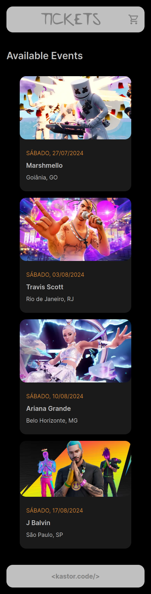
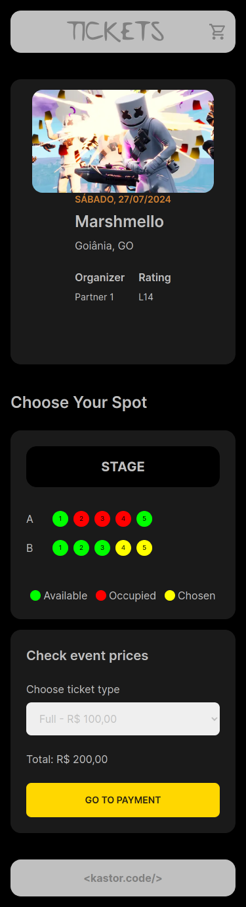
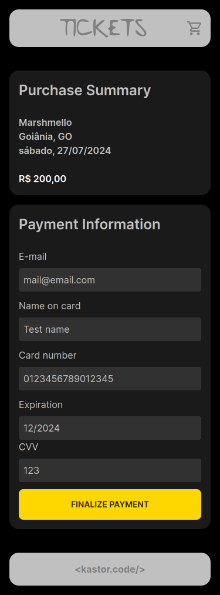
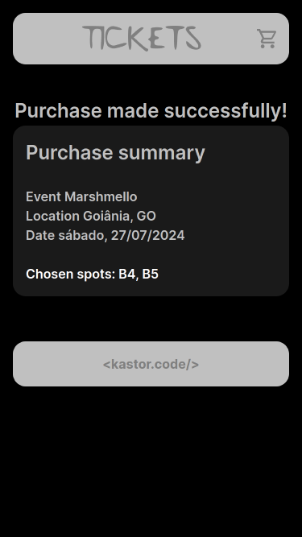
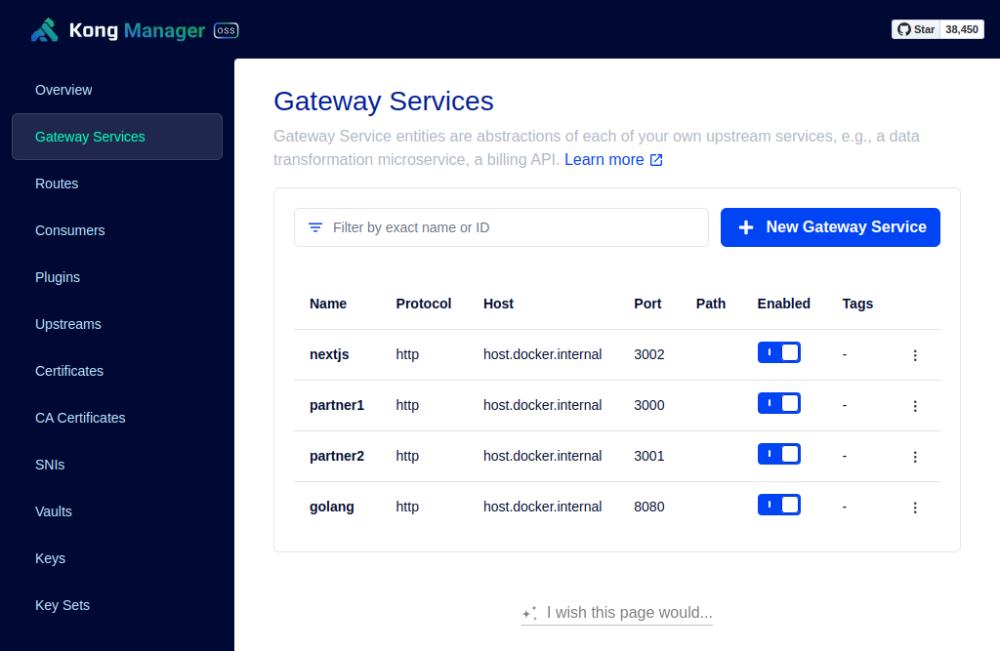
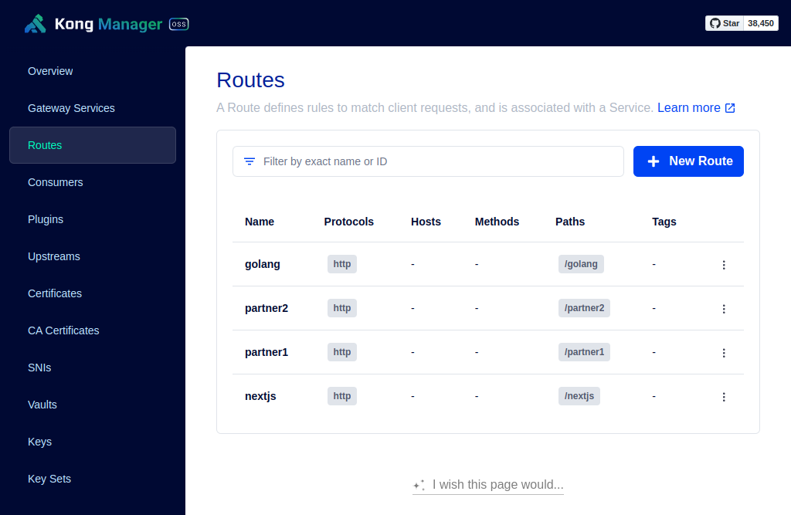
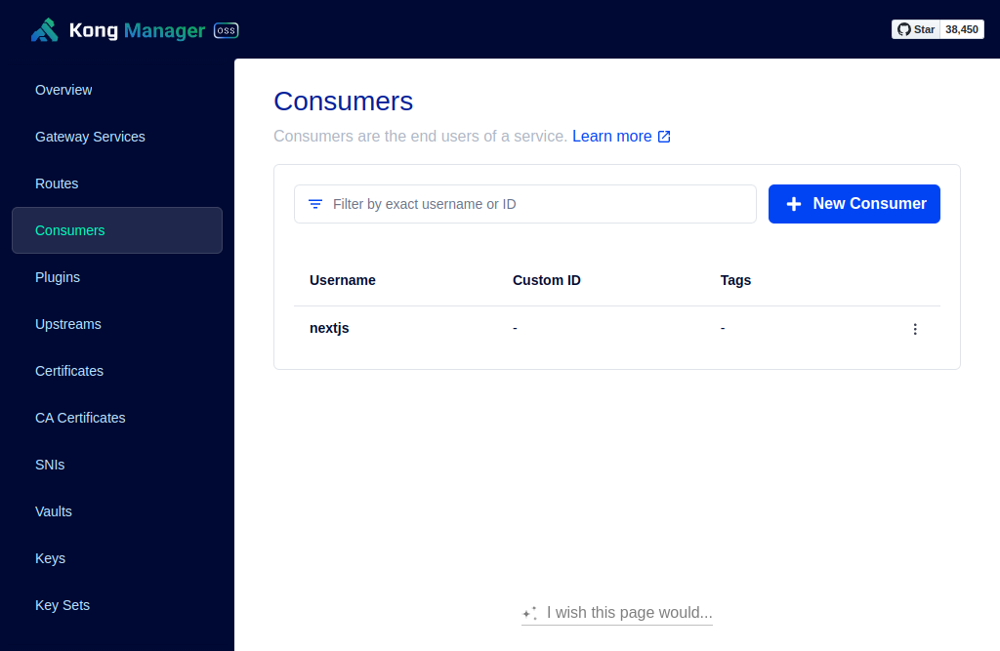
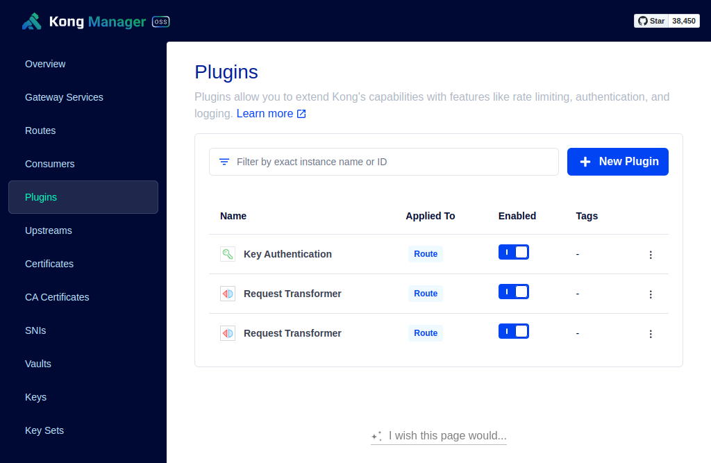

## Ticket Sales System with: Golang, Kong, Nest.js and Next.js

> 👨‍💻 Developed by Matheus Ramalho de Oliveira  
🏗️ Brazilian Software Engineer  
✉️ kastorcode@gmail.com  
🦫 [LinkedIn](https://br.linkedin.com/in/kastorcode) • [Instagram](https://instagram.com/kastorcode)

---

This project is a comprehensive ticket sales system built using a microservices architecture and a set of modern technologies to ensure high performance, scalability and ease of maintenance:

  &nbsp;<b>Docker</b>: OS-level virtualization tool to deliver the application in containers.

 

  &nbsp;<b>Kong</b>: API gateway for routing, load balancing and validating API calls. It centralizes HTTP calls and is using declarative configuration.

 

  &nbsp;<b>PostgreSQL</b>: Free and open-source relational database management system for storing persistent data.

 

  &nbsp;<b>Nest.js</b>: JavaScript framework for developing RESTful APIs with Node.js and TypeScript. It has 3 apps, 2 partners and 1 to populate the database with test data. Built with standard Nest features.

 

  &nbsp;<b>Prisma ORM</b>: Object-Relational Mapping library that abstracts the interaction with the database in Nest.js partner applications.

 

  &nbsp;<b>Golang</b>: Performant and secure programming language for developing API services. Main API that serves data provided by partners. Developed with the DDD (domain-driven design) design pattern.

 

  &nbsp;<b>Next.js</b>: For the frontend. React framework for developing server-rendered and static web applications. The node-api folder is an events data mock.

 

  &nbsp;<b>Tailwind CSS</b>: A utility-first CSS framework for creating responsive interfaces without leaving HTML.

---

### Screenshots

  
  
  
  
  
  
  
  

---

### Installation and execution

Docker Compose

1. Make a clone of this repository;
2. Open the project folder in a terminal;
3. Run `docker compose up -d` to up all necessary containers at once;
4. You will get 6 containers: `golang`, `golang-postgres`, `kong`, `nestjs-app`, `nestjs-postgres` and `nextjs-app`.

Golang Core API

1. Run `docker exec -it golang sh` to enter its container;
2. Run `go run cmd/events/main.go` to start the main backend at port `8080`.

Nest.js Partners API

1. Run `docker exec -it nestjs-app sh` to enter its container;
2. Run `yarn` to install dependencies;
3. Run `yarn migrate:partner1 && yarn migrate:partner2` to sync the database to Prisma;
4. Run `yarn start:dev fixture` to populate the partners database with the same data from the Golang API;
5. Run `yarn start:dev` to start the Partner 1 server at port `3000`;
6. Run `yarn start:dev partner2` to start the Partner 2 server at port `3001`.

Next.js Client

1. Run `docker exec -it nextjs-app sh` to enter its container;
2. Run `yarn` to install dependencies;
3. Run `yarn dev` to launch the development server;
4. You can access the frontend at `http://localhost:8000/nextjs` or `http://host.docker.internal:8000/nextjs`.

You can access the Kong Manager at `http://localhost:8002` or `http://host.docker.internal:8002`.

The `api.http` files has CURL requests that can be made using the [REST Client](https://marketplace.visualstudio.com/items?itemName=humao.rest-client) extension.

The containers communicate over an internal Docker network at the `host.docker.internal` address. If you want to access this address outside of Docker, add `127.0.0.1 host.docker.internal` in the file `/etc/hosts`.

---

  <big><b>&lt;kastor.code/&gt;</b></big>

